# 투자 초보 인생을 바꿀 5가지 단타 매매법 — 학습 정리

| 항목 | 내용 |
|---|---|
| 원본 | https://youtu.be/F3exGqdN2Go |
| 채널 | 쉽알남 (`@쉽.알.남`) |
| 업로드 | 2025-12-16 · 21분 40초 |
| 정리일 | 2026-08-05 |
| 자료 출처 | 자동 자막(`youtube_transcript_api`) 전문 + 영상 프레임 34장 (`ffmpeg` 추출) |
| 차트 이미지 | `assets/2025-12-16-5methods/` |

> **이 문서의 성격**
> 영상 내용을 **그대로** 옮겨 구조화한 학습 노트다. 백테스트·검증은 하지 않았고,
> 여기 적힌 어떤 문장도 "수익이 난다"는 뜻이 아니다. 검증은 별도 작업으로 남긴다.
> (§8에 검증 전에 반드시 정의해야 할 모호한 지점들을 정리해 뒀다.)

---

## 0. 영상의 전제 — 무엇을 배우고 무엇을 버리는가

### 0-1. 보조지표가 아니라 '작도(作圖) 분석'

기술적 분석은 크게 두 갈래다.

| 갈래 | 예시 | 영상의 입장 |
|---|---|---|
| **보조지표 분석** | RSI, MACD, 볼린저밴드 | "신뢰도가 낮다는 게 아니다. 다만 **후행성**이 가장 큰 단점. 이미 나온 차트를 수학적으로 가공한 **과거의 기록**이다. 보조는 보조일 뿐 메인이 될 수 없다." |
| **작도 분석** ← 오늘의 주제 | 오더블록, FVG, 추세선, 채널, 페이크아웃/트랩 | 차트와 **가격 그 자체**를 분석한다 |

영상은 트레이딩뷰 **무료 버전(지표 2개 제한)**만으로 진행한다. "지표가 있어야만 트레이딩을 할 수 있다고 생각하지만, 이런 환경에서도 트레이딩을 할 수 있다는 걸 보여주겠다"는 게 도입부의 선언이다.

### 0-2. 두 개의 키워드

전체 5강이 이 두 단어 위에서 전개된다.

1. **스마트머니** — 기관·세력, 즉 큰손
2. **시장의 구조** — 유동성이 어디에 쌓이고 누가 그걸 먹는가

### 0-3. 반드시 알고 갈 것

> "기술적 분석은 **미래를 예언하는 도구가 아니다.** 미래를 예언할 수 있는 거라면 저도 유튜브 같은 거 안 하겠죠. 하지만 가격이 움직이는 방향을 **확률 높은 시나리오**로 제시할 수 있는 강력한 도구이기도 합니다."

마지막 멘트도 같은 얘기다.

> "기술적 분석이 무적은 아닙니다. 트레이딩은 결국 **리스크를 어떻게 잘 줄이느냐가 1순위**예요. 이 기술적 분석은 그 리스크를 줄여주기 위한 도구일 뿐이라고 생각하시면 됩니다."

---

## 1. 5강 전체를 관통하는 공통 문법 ★

개별 기법보다 이게 먼저다. 영상은 4강 끝에서 이걸 명시적으로 묶는다.

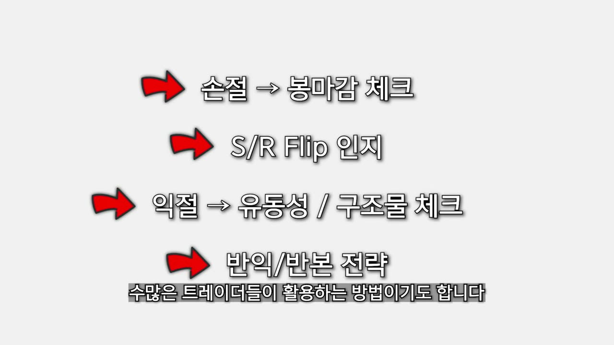

| # | 원칙 | 뜻 (쉬운 말) |
|---|---|---|
| 1 | **손절 → 봉마감 체크** | 선을 살짝 스쳤다고 바로 자르지 말고, 그 봉이 **끝날 때까지** 기다려서 벗어난 채로 마감했는지 본다 |
| 2 | **S/R Flip 인지** | **지지가 뚫리면 저항이 되고, 저항이 뚫리면 지지가 된다.** 뚫린 선은 사라지는 게 아니라 역할이 뒤집힌다 |
| 3 | **익절 → 유동성 / 구조물 체크** | 익절은 늘 ① 유동성을 흡수하는 자리(직전 고점·저점) 또는 ② 반대 구조물(반대 패턴)이 나올 때 한다 |
| 4 | **분익 / 본절 전략** | 일부 익절했으면 남은 물량의 스탑로스를 **평단(진입가)**으로 올려서 손실 가능성을 0으로 만든다 |

> "이 부분은 모든 트레이딩 전략에서 활용이 가능하고 수많은 트레이더들이 활용하는 방법이기도 합니다. **그런데 사실 못 지키는 사람들이 태반이에요.** 이게 결국 리스크 관리와도 연결되는 부분이고…"

**용어 하나만 미리:** "**유동성(liquidity)**"은 이 영상에서 사실상 **"손절 주문이 몰려 있는 자리"**를 뜻한다. 직전 고점 위, 직전 저점 아래, 추세선 아래 — 개인들이 스탑로스를 걸어둔 곳이다. 스마트머니 입장에서 그건 "공짜로 받아먹을 수 있는 물량"이다. 그래서 "유동성을 흡수한다 = 그 손절 물량을 털어서 삼킨다"는 말이 반복된다.

---

## 2. 1강 — 오더블록 (Order Block, OB)

### 2-1. 정의

스마트머니의 **대량 주문이 발생한 흔적**.

큰손은 천문학적인 자금을 굴리기 때문에 한 번에 매집하는 게 불가능하다. 한 번에 매수하면 호가를 다 잡아먹으면서 올라가버린다. 그래서 **특정 가격대에서 의도적으로 물량을 모으거나 털어낸다.** 그 과정에서 남는 흔적이 오더블록이다.

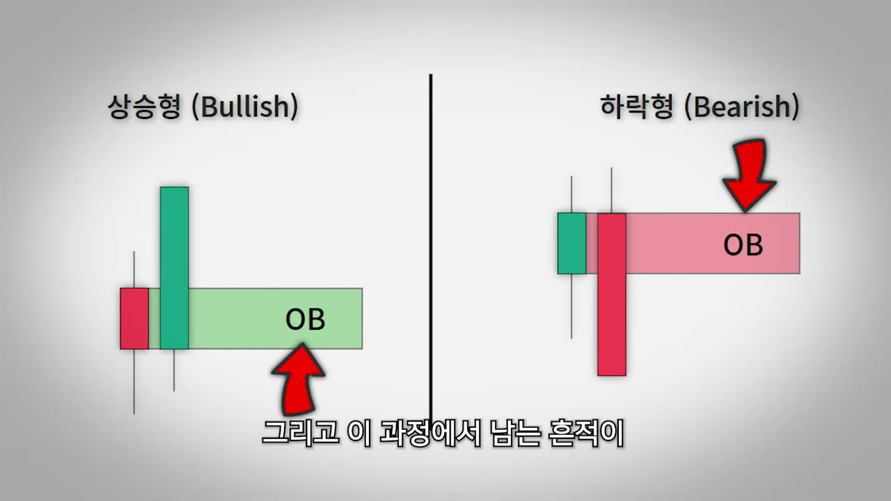

| 유형 | 생김새 | 의미 |
|---|---|---|
| **상승형 (Bullish OB)** | 음봉의 몸통을 잡아먹는 **양봉**이 나옴 | 이 가격대가 큰손들이 **매집**하는 구간 |
| **하락형 (Bearish OB)** | 양봉의 몸통을 잡아먹는 **음봉**이 나옴 | 이 가격대가 큰손들이 **물량을 털어내는** 구간 |

> 아래 설명은 전부 **상승형** 기준이다. 하락형은 "똑같이 반대로 생각"하면 된다는 게 영상의 안내다.

### 2-2. 왜 만들어지는가 — 형성 메커니즘 (6단계)

**① 그냥 사면 손해다 (슬리피지)**

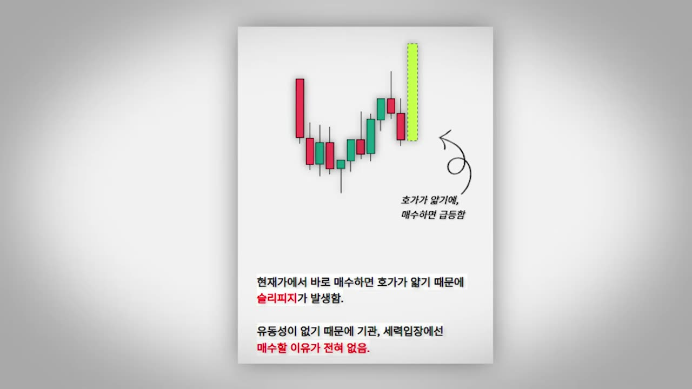

큰손이 지금 가격에서 바로 매수하면 호가창이 텅 비면서 가격이 순식간에 폭등한다. 이후엔 받쳐주는 물량이 없으니 다시 수직 낙하하고, 결국 **매우 비싸게 매집한 셈**이 된다. 이걸 "슬리피지가 발생했다"고 한다.

**② 그래서 남이 파는 물량을 받아야 한다**

사람들이 물량을 파는 이유는 대부분 **손절할 때**다.

**③ 손절을 유도한다 (스탑 헌팅)**

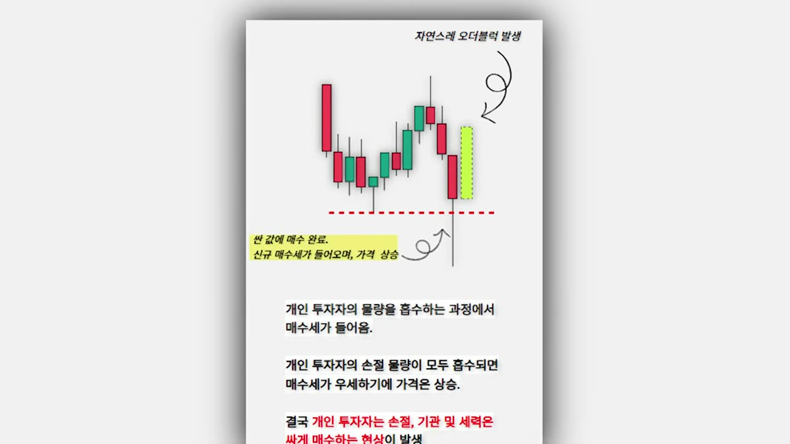

큰손은 사람들의 스탑로스 주문이 걸려 있을 법한 구간까지 **공매도를 이용해 의도적으로 가격을 하락**시킨다. 스탑로스가 발동되면 그 물량을 **헐값에 전부 받아먹고**, 추가 매수까지 하면서 가격을 급등시킨다.

**④ 그런데 그 공매도가 손실이다**

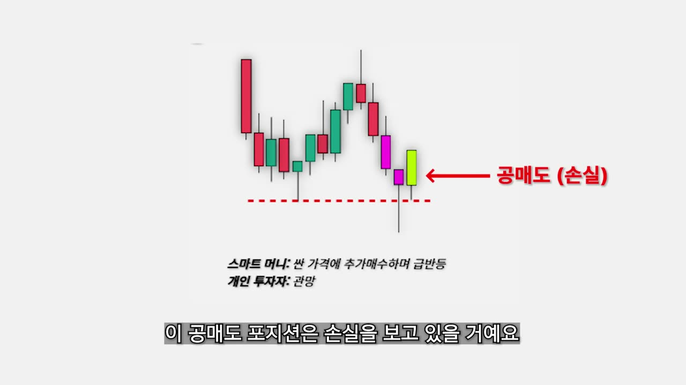

가격을 급등시켰으니 ③에서 쓴 공매도 포지션은 손실 상태다. 헐값 매수 덕에 전체로는 수익이지만, **이 공매도를 정리하고 상승하는 게 본인들 입장에선 당연히 이득**이다.

**⑤ 그래서 가격을 방치한다 → 오더블록으로 되돌아온다**

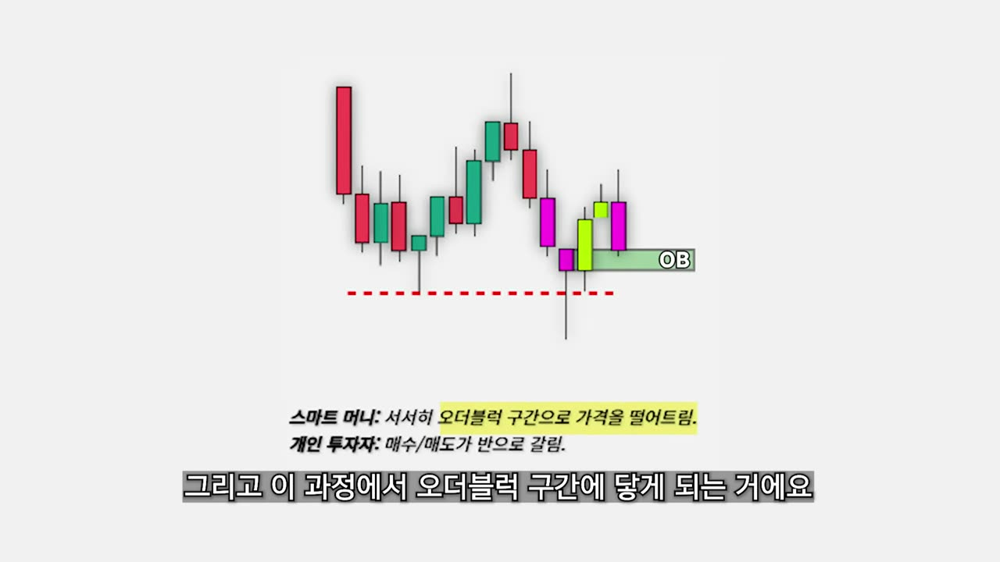

어느 정도 올린 뒤 가격을 방치한다. 상승을 주도하던 매수세가 사라지면 시장은 개인들의 관성으로만 움직이고, 대부분 크게 오르지 못한 채 **횡보하거나 천천히 우하향**한다. 그러면서 자연스럽게 **오더블록 구간에 닿는다.**

**⑥ 여기서 공매도를 정리한다 = 또 한 번의 강한 매수세**

이 구간은 큰손이 공매도를 정리하기에 가장 적절한 자리다. 공매도 정리(숏 커버링)는 곧 **강력한 매수세**로 작용한다. 공매도는 손실 없이 종료되고, 밑에서 헐값에 매수한 물량은 수익을 극대화한다.

> **핵심 결론:** 오더블록에 가격이 되돌아오는 경우를 심심치 않게 볼 수 있는 이유가 이것이다. 오더블록은 **스마트머니가 싼 가격에 매집하는 과정에서 자연스럽게 나오는 패턴**이다.

### 2-3. 매매법

#### 진입

- **원칙: 오더블록이 생긴 구간에 진입한다.**
- **닿지 않으면 다른 근거가 있지 않은 한 굳이 진입하지 않는다.**

#### 신뢰도를 높이는 조건 (필터)

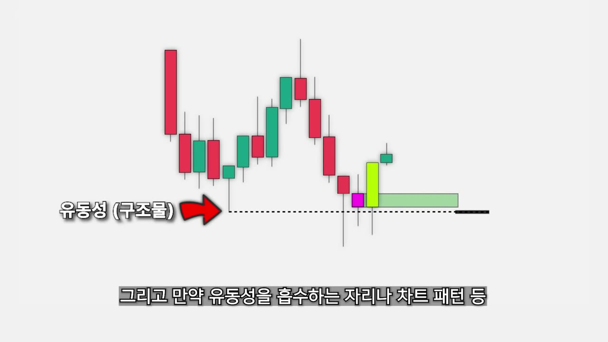

| 조건 | 설명 |
|---|---|
| **위치** | **유동성을 흡수하는 자리**나 **차트 패턴 등 구조물이 생기는 자리**에서 오더블록이 발생하면 신뢰도가 올라간다 |
| **크기** | 오더블록을 만든 **두 캔들의 몸통 크기가 2배 이상 차이**나면 신뢰할 만한 오더블록으로 식별된다 |

#### 손절 — 2가지 기준

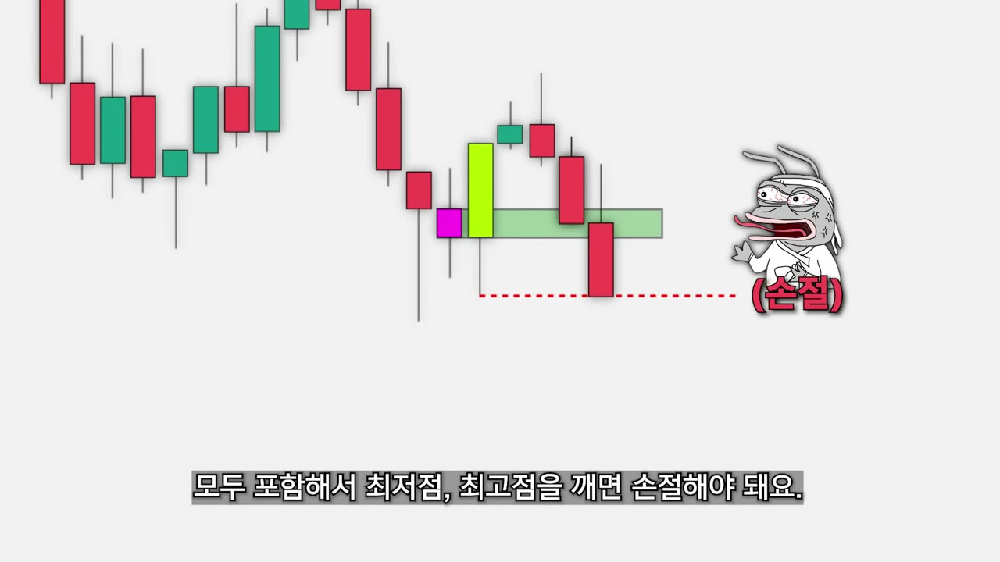

| 기준 | 내용 | 승률 | 손실폭(리스크) |
|---|---|---|---|
| **기준 1** | 오더블록을 형성한 캔들의 **꼬리 끝**을 깨면 손절. 두 캔들이든 세 캔들이든 **모두 포함**한 최저점(롱)·최고점(숏)이 깨지면 손절 | 낮음 | 작음 |
| **기준 2** | 꼬리 끝을 벗어나서 **봉마감**을 할 때 손절 | 확실히 높음 | 큼 |

> "각 기준마다 장단점이 있고요. 물론 매매를 할 때 오더블록만으로 하는 건 아니니까 다른 기준이랑 같이 살펴보면서 **상황에 맞게 유연하게** 선택하면 됩니다."

#### 익절 — 4가지 기준

진입 자체가 오더블록 구간(=눌림목)에서 이뤄지므로, 눌림목 **이전에 오더블록을 만든 파동**이 하나 있다. 익절 기준은 거기서 시작한다.

**기준 1 — 직전 파동의 고점 (유동성 구간)**

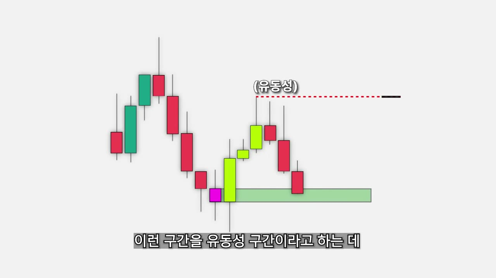

> "이런 구간을 유동성 구간이라고 하는데, 이런 구간은 통상적으로 수익 실현 — 용어로는 **커버링**이라고 합니다. 이런 자리는 트레이더들 사이에선 거의 **커버링 국룰 자리**고, 그래서 매도세가 나오면서 **저항이 발생**할 수 있다는 겁니다. 많은 사람들이 매도를 하니까 당연히 흐름에 맞게 우리들도 해야 되는 거예요."

여기서 선택지는 둘이다.
- ⓐ 1차 익절 + **진입 구간에 스탑로스**를 걸어둔다 (= 본절, 손실 가능성 제거)
- ⓑ 전부 익절하고 다음 자리를 기다린다

**기준 2 — 구조물의 돌파 자리**

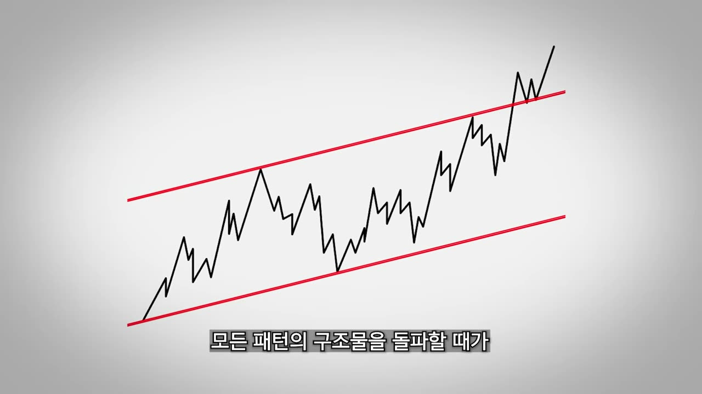

일반적으로는 고점 돌파 자리를 말하지만, **모든 패턴 구조물의 돌파**가 포함된다. 삼각수렴 패턴 돌파, 컵앤핸들 패턴 돌파, 상승 채널 상단 돌파 등.

**기준 3 — 반대 오더블록의 출현**

상승 오더블록에서 매수했는데 **하락 오더블록**이 발생한 경우. 상승 근거가 하락 근거로 인해 소멸되니 포지션을 끌고 갈 필요가 없다.

**기준 4 — 반대 구조물의 출현**

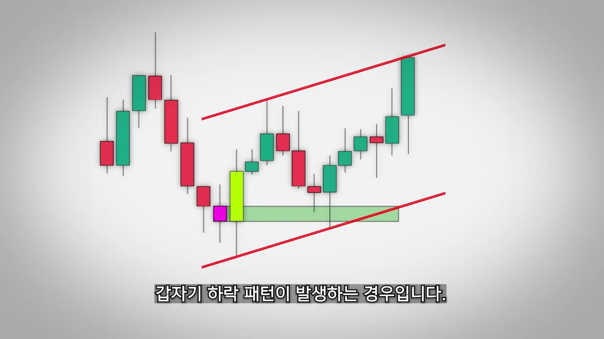

잘 상승하고 있는데 갑자기 **하락 패턴**이 발생한 경우. "이러면 주저 없이 바로 포지션을 닫는 게 맞습니다. 마찬가지로 상승 근거가 소멸되니까요."

---

## 3. 2강 — FVG (Fair Value Gap, 공정가치 갭)

### 3-1. 정의

스마트머니가 정보 및 자금력을 이용해 만드는 패턴. 본인들이 원하는 가격으로 **빠르게 이동시키기 위해 시장에 개입할 때** 발생한다. 대부분 **가격의 불균형**을 이용해 이동시킨다.

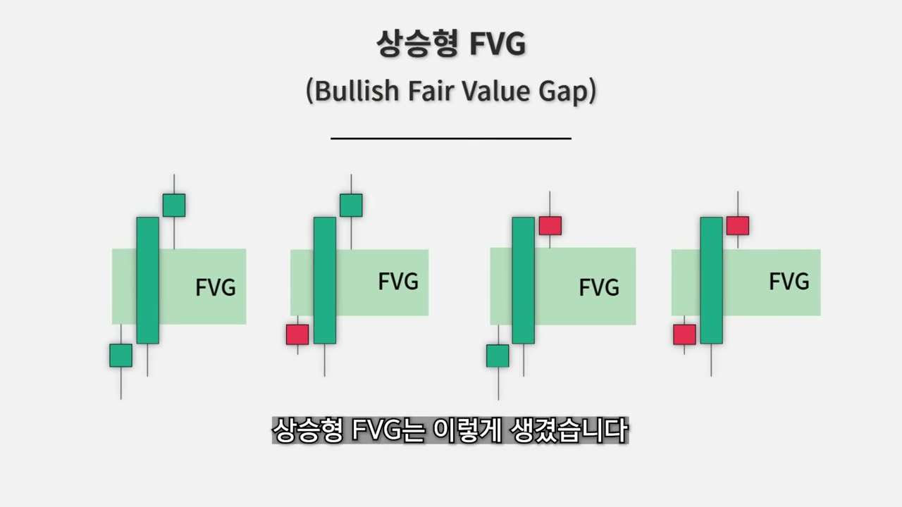

> **연속된 3개 캔들 사이에 만들어진 빈 공간이 FVG다.** (하락형도 마찬가지, 방향만 반대)

### 3-2. 왜 만들어지는가 — 형성 메커니즘

1. 천문학적인 자금으로 주문을 넣으면 매수·매도 호가가 순식간에 없어지면서 **가격이 순식간에 이동**한다
2. 이 과정에서 **미처 체결되지 못한 주문들**이 남는다
3. 이 주문들을 체결시키기 위해, 어느 정도 가격을 이동시킨 뒤 **시장을 방치**한다 → 시장은 다시 원래 가격으로 돌아간다
4. 주문들이 마저 체결되면 스마트머니는 **다시 가격을 올리기 시작**한다
5. 미처 탑승하지 못한 개인 투자자들은 FOMO가 발생하고, **가격이 이미 이동한 후에 이성을 잃고 뒤늦게 진입**한다

> "아이러니하게도 **스마트머니의 개입이 멈출 때 개인 투자자의 거래가 가장 활발해지는데**, 어떤 거래를 하더라도 스마트머니보다는 불리하게 거래를 할 수밖에 없는 상황이 됩니다."

### 3-3. 매매법

#### 진입

- **원칙: FVG가 생긴 구간에 진입한다.** 오더블록과 동일.
- **닿지 않았다면 진입하지 않는 걸 권장한다.**

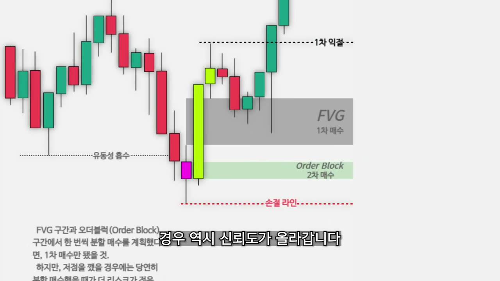

#### 신뢰도 조건

| 방향 | 조건 |
|---|---|
| 신뢰도 **↑** | **유동성을 흡수한 자리**에서 발생하면 크게 올라간다 |
| 신뢰도 **↑** | **오더블록이 출현한 이후 FVG가 연속해서 발생**하는 경우 |
| 신뢰도 **↓ (주의)** | 연속된 **3개 캔들의 크기가 모두 비슷하면** FVG로서의 역할을 못 할 가능성이 높다 |

> 위 이미지는 FVG 구간과 오더블록 구간이 겹칠 때 **분할 매수**(FVG=1차 매수, OB=2차 매수)로 계획하는 예시다. 손절 라인은 그 아래에 하나로 둔다.

#### 손절 — 3가지 기준

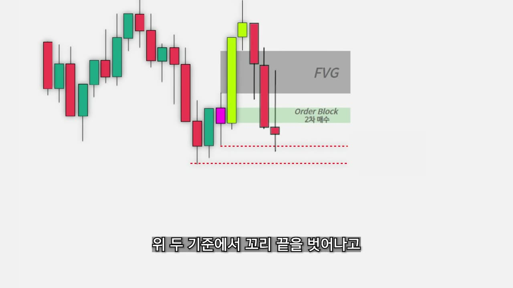

| 기준 | 내용 | 승률 | 리스크 |
|---|---|---|---|
| **기준 1** | FVG를 형성한 **연속된 3개 캔들의 꼬리 끝**을 벗어나면 즉시 손절 | 낮음 | 작음 |
| **기준 2** | FVG를 형성하면서 발생한 **파동 전체의 꼬리 끝**을 벗어나면 손절 | 기준1보다 높음 | 큼 |
| **기준 3** | 위 기준에서 꼬리 끝을 벗어나 **봉마감**을 할 때 손절 | 훨씬 높음 | 더 큼 |

> "차트 상황이란 게 항상 똑같을 순 없으니까 각자 상황에 맞게 유연하게 잘 사용하시면 될 것 같습니다."

익절 기준은 별도로 언급하지 않는다 → §1의 공통 원칙(유동성 흡수 자리 / 반대 구조물)을 따른다.

---

## 4. 3강 — 추세선 (Trend Line)

> **역할 구분:** 오더블록·FVG가 **명확한 타점**을 찾는 도구라면, 추세선은 **시장의 방향**을 읽는 가장 직관적인 도구다.

### 4-1. 왜 만들어지는가

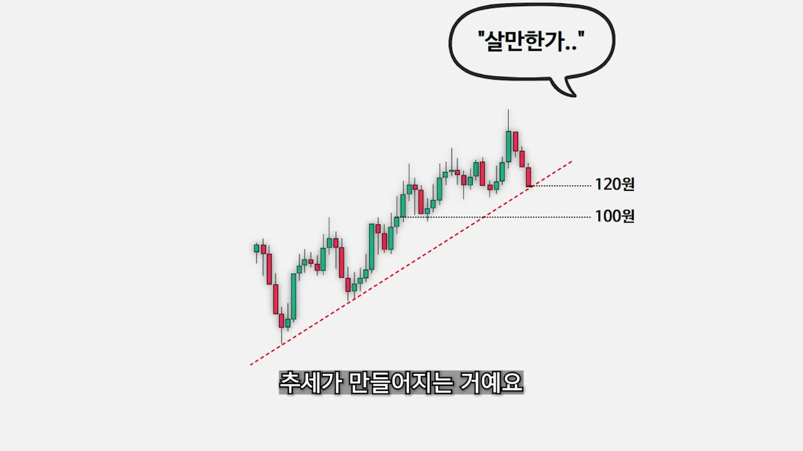

1. 추세가 이어지다 보면 사람들은 점점 **가격에 익숙해진다.** 이전에 비싸다고 생각했던 지점이 "매수할 만하다"로 바뀐다
2. 전 세계 수많은 트레이더가 **같은 트렌드라인을 보고** 트레이딩한다. 닿으면 매수하려는 트레이더가 많으니 그만큼 매수세가 나오고, 그럼으로써 **추세가 유지된다** (자기실현적)

### 4-2. 왜 반드시 깨지는가

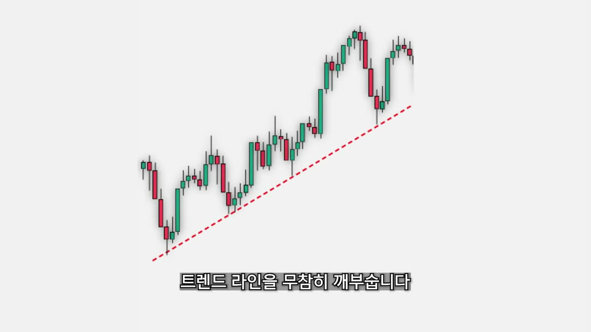

전 세계가 같은 선을 보고 있다는 건, 그 선 아래에 **수많은 스탑로스 = 유동성이 몰려 있다**는 뜻이다. 스마트머니는 이걸 이용한다.

> "스마트머니는 트렌드라인 초기에는 **오히려 형성에 도움을 줍니다.** 개미들을 유인하는 거죠. **양식장에 먹이를 주는 것과 같은 원리**입니다. 먹이를 주면서 살을 찌우다가 충분하다고 판단되면 트렌드라인을 무참히 부숩니다."

선이 깨지면 순식간에 매도 물량이 쏟아지고, 그 물량으로 가격이 하락한다. 그 하락 과정에서 스마트머니는 천천히 **싼 가격에 매집**한다.

> **"트렌드라인은 결국에는 깨지게 설계되어 있습니다."**

### 4-3. 매매법 — 2가지

#### 전략 A. 추세 추종 매매

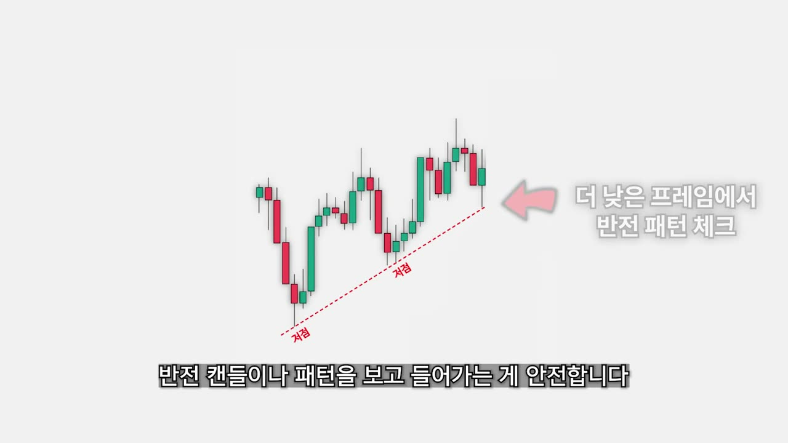

| 항목 | 기준 |
|---|---|
| **진입** | 상승 트렌드면 라인을 **터치할 때** 진입. 단, 무작정 들어가는 것보다 **하위(낮은) 타임프레임에서 반전 캔들이나 패턴을 보고** 들어가는 게 안전하다 |
| **손절** | 진입 근거였던 **반전 캔들/패턴이 깨질 때.** 이 경우 대부분 트렌드라인 아래다 — 추세가 깨졌으니 손절하는 게 당연 |
| **익절** | 직전 고점(= 유동성 흡수 자리) 또는 구조물 돌파 |

> ⚠️ **자막 오류 주의:** 자동 자막에는 "하이프레임"으로 찍혀 있으나, 화면 자료에는 **"더 낮은 프레임에서 반전 패턴 체크"**, 4강 자료에는 **"하위 타임 프레임에서 반전 구조물(OB, FVG 등) 확인 후 진입하는 게 좋음"**이라고 적혀 있다. **하위 타임프레임**이 맞다.

#### 전략 B. 추세 반전 매매

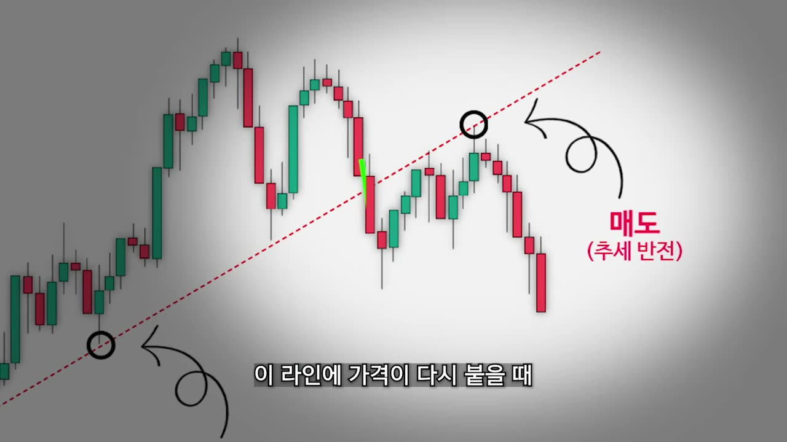

트렌드라인이 **깨졌을 때** 진입하는 매매다. 깨진 후 가격이 그 라인에 다시 붙을 때(= **리테스트**) 역추세로 진입한다. **지지를 받았던 구조물이 뚫리면 저항으로 바뀌는 원리**(S/R Flip)를 이용한다.

| 항목 | 기준 |
|---|---|
| **진입** | 돌파 후 **리테스트** 시점 |
| **손절 1** | 돌파를 만든 **파동의 시작점**이나 직전 고점/저점 |
| **손절 2** | 돌파됐던 트렌드라인을 **다시 역으로 돌파**할 때 |
| **익절** | 유동성을 흡수하는 자리 또는 **역추세 패턴** 발생 시 |

### 4-4. 영상이 붙인 단서

> "하지만 트렌드라인은 사실 **메인으로 사용하기보단 서브로 사용하는 게 보편적**이고요. 트렌드라인은 이후 5강에 나올 **페이크아웃과 트랩을 섞어서 사용하는 게 훨씬 좋습니다.**"

---

## 5. 4강 — 채널 (Channel)

### 5-1. 정의와 구조

> "채널링은 사실 3강 트렌드라인의 **업그레이드 버전**이라고 생각하시면 됩니다."

두 개의 **평행한** 트렌드라인으로 이루어져 있고, 가격이 일정한 파동으로 움직이는 걸 직관적으로 시각화하는 도구다.

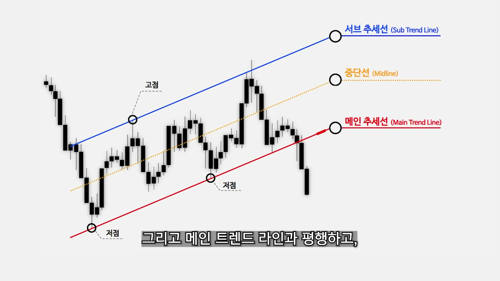

| 구성 요소 | 설명 |
|---|---|
| **메인 추세선 (Main Trend Line)** | 추세의 기준이 되는 선 |
| **서브 추세선 (Sub Trend Line)** | 메인과 **평행**하고, 반대쪽 고점 혹은 저점에 맞춘 선 |
| **미들라인 (Midline)** | 두 선의 **중앙**에 위치한 선 |

작도에는 **3개의 점**이 필요하다.

### 5-2. 채널의 장점

> "채널의 장점은 **과매수·과매도 구간을 미리 예측할 수 있다**는 점입니다."

상승 트렌드에서 서브 트렌드라인까지 그려두면, "가격이 상승해서 서브 트렌드라인에 닿는다면 **이 구간은 과매수 구간이고 매도를 하는 구간**"이라고 미리 판단할 수 있다. 즉 **트레이딩 시나리오를 미리 짤 수 있다.** 그 구간은 수익 실현의 근거가 될 수도, 신규 매도 포지션의 근거가 될 수도 있다.

### 5-3. 채널의 4가지 유형

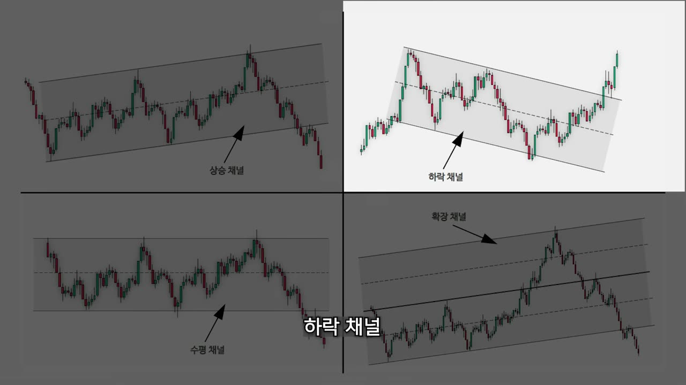

| 유형 | 정의 | 특징 |
|---|---|---|
| **상승 채널** | 저점과 고점이 **동시에 높아짐** | **하방 돌파**로 연결될 가능성이 높다 |
| **하락 채널** | 고점과 저점이 **동시에 낮아짐** | **상방 돌파**로 연결될 가능성이 높다 |
| **수평 채널** | 고점과 저점이 일정 | 상하단에서 **휩쏘(= 5강의 페이크아웃/트랩)가 빈번**하게 발생 |
| **확장 채널** | 위 세 채널의 기출 변형. 채널이 **같은 크기로 확장** | 상승 채널에선 위로 확장, 하락 채널에선 아래로 확장 |

### 5-4. 스마트머니는 채널을 어떻게 쓰는가

> "결국 최종 목적은 **유동성을 쌓고 먹어치우는 것**이 스마트머니의 목적입니다."

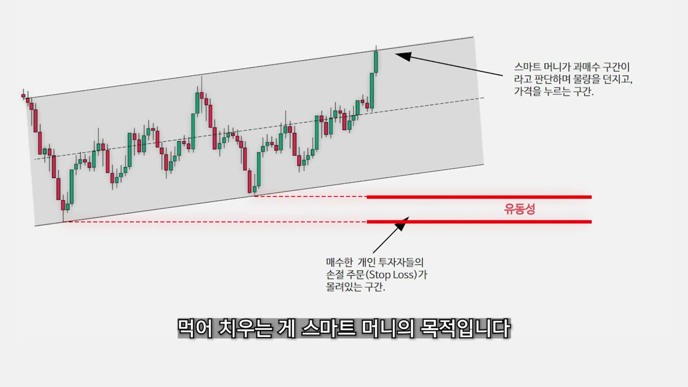

1. 채널을 만들면서 **유동성을 쌓는다** (채널 아래에 개인들의 스탑로스가 쌓임)

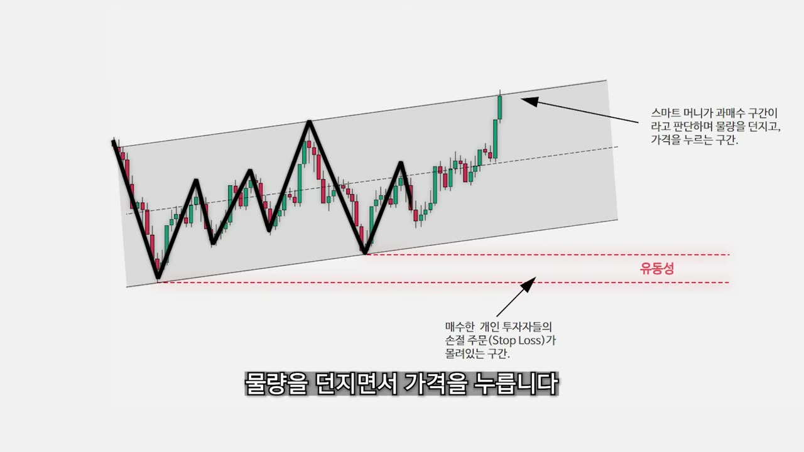

2. 어느 정도 **과매수 구간에 닿을 때마다 물량을 던지면서 가격을 누른다** → 채널이 유지된다
3. 유동성이 충분히 채워졌다 싶으면 **흡수하러 간다.** 채널을 깨뜨리면서 쌓여 있는 유동성을 다 흡수하며 물량을 채운다
4. 충분히 흡수했다면 다시 가격을 반전시켜 **채널 내부로 들어오거나** 또 다른 추세를 만든다

> "결국엔 또 개인 투자자만 헐값에 물량을 넘기고 눈가가 촉촉해지는 거예요. **근데 사실 어쩔 수가 없어요. 돈 많은 스마트머니를 우리가 절대로 이길 수는 없습니다.** 결국 우리는 스마트머니가 움직이면서 흘리는 **빵조각을 먹으면서** 연명하는 수밖에 없습니다. 우리가 할 수 있는 트레이딩도 사실 이 빵조각을 먹는 것을 목표로 하는 거예요."

### 5-5. 매매법 — 3가지

#### 전략 A. 역추세 매매

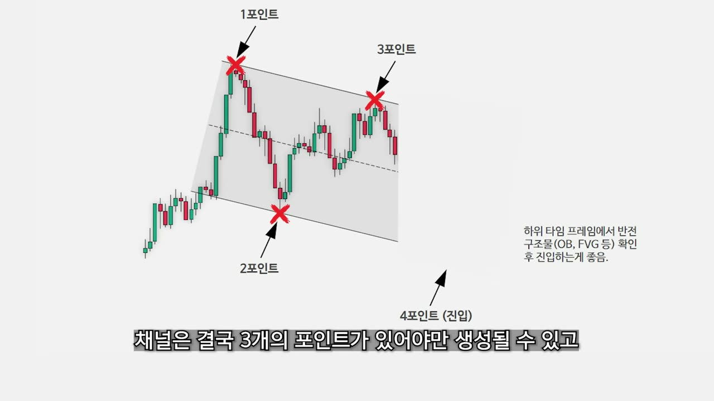

채널이 생성된 후 과매수/과매도 구간에서 역추세로 진입한다. 채널은 3개의 포인트가 있어야 생성되고, **우리가 들어갈 타점은 4포인트 구간**이다. (하락 채널 예시 → 4포인트는 과매도 구간이므로 **매수** 진입)

| 항목 | 기준 |
|---|---|
| **진입** | 4포인트 구간. **하위 타임프레임에서 반전 구조물(OB, FVG 등) 확인 후** 진입하는 게 좋다 |
| **손절** | 채널을 그대로 돌파하면 **봉마감을 체크**하고, 이탈 마감이 확정되면 바로 손절 |
| **익절 1** | 반등에 성공했다면 **채널의 반대편(메인 트렌드라인) 도달** 지점. 풀 익절도, 부분 익절도 가능 |
| **익절 2** | 부분 익절했다면 **평단에 스탑로스**를 걸고 채널 이탈까지 지켜보다가, 유동성을 먹는 자리나 패턴 구조물을 보고 익절 |

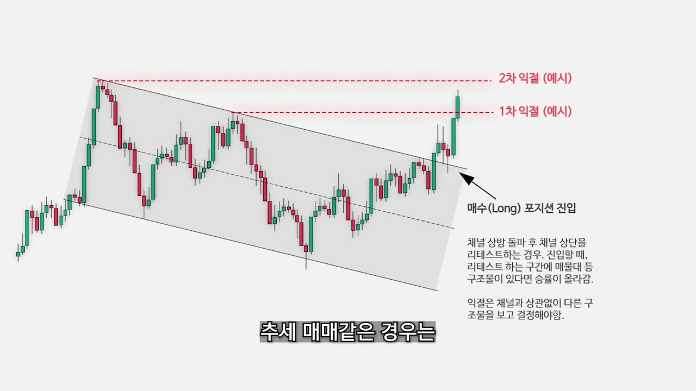

#### 전략 B. 추세 매매 (채널 이탈 후 리테스트) — S/R Flip

> "지지는 뚫리면 저항이 되고, 저항이 뚫리면 지지가 됩니다."

하락 채널 예시: 저항이었던 **채널 상단을 뚫으면** 그 구간은 **지지 구간으로 바뀐다.** 그 가격을 **리테스트할 때 진입**한다.

| 항목 | 기준 |
|---|---|
| **진입** | 돌파한 채널 경계선의 리테스트 |
| **손절** | 리테스트가 실패하고 채널로 다시 들어와 **봉마감**할 때 |
| **익절** | 유동성을 흡수한 자리 또는 반대 구조물 |

**변형: 이탈했다가 재진입한 케이스**

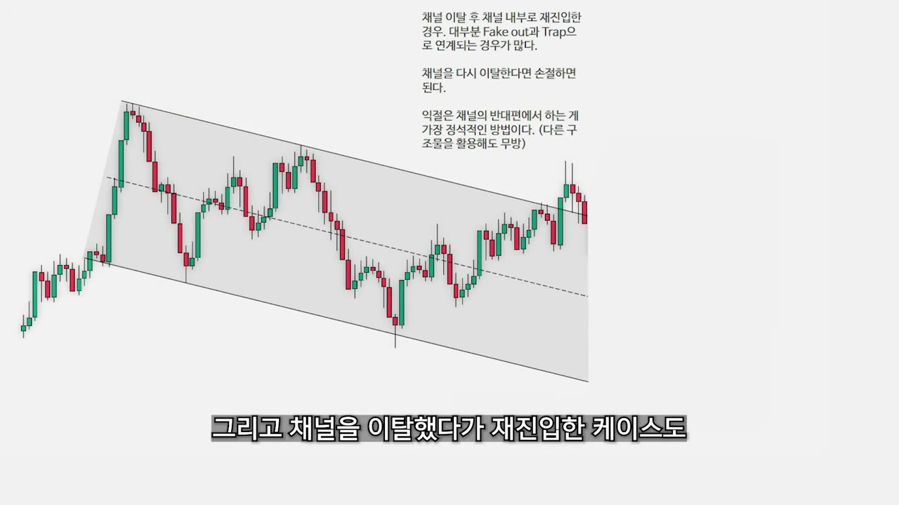

하락 채널을 상방 돌파했다가 **다시 채널 내부로 들어온** 경우. 지지였던 구간이 뚫리면 저항으로 바뀌니, 내부로 들어온 순간 **채널 상단은 저항**이 된다. 따라서 채널 상단을 **리테스트할 때가 진입 포인트**(숏).

- 손절: 채널을 이탈하고 마감할 때
- 익절: 채널 반대편이 정석. 다만 유동성 흡수 자리나 반대 구조물이 출현할 때마다 분할 익절해도 무방

#### 전략 C. 돌파 매매

가장 단순하다.

| 항목 | 기준 |
|---|---|
| **진입** | 채널이 뚫리면 **추격 매매** |
| **손절** | 다시 채널 내부로 들어오면 |
| **익절** | 반대 구조물이나 유동성 자리. 또는 **확장 채널의 중단·맨 반대편**을 이용 |

---

## 6. 5강 — 페이크아웃 & 트랩 (거짓 돌파와 함정) ★ 메인 주제

> "앞선 1~4강이 **정석을 배우는 과정**이었다면, 5강은 **그 정석을 스마트머니가 어떻게 부수고 이용하는가**에 대한 내용입니다."
>
> "차트에 예쁘게 그려진 지지·저항선은 **스마트머니가 언젠가는 다 잡아먹을 구간**입니다."

### 6-1. 둘의 차이

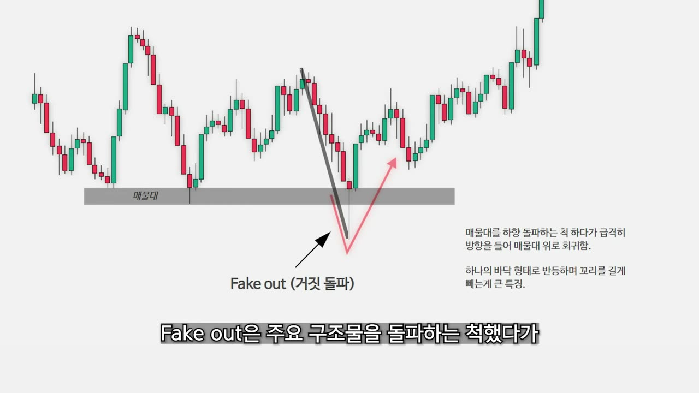

**페이크아웃 (Fake out, 거짓 돌파)**
- 주요 구조물을 **돌파하는 척했다가 급격히 반대 방향으로 회귀**
- **긴 꼬리**를 만들면서 형성되는 게 큰 특징
- **하나의 바닥 혹은 고점** 형태로 형성

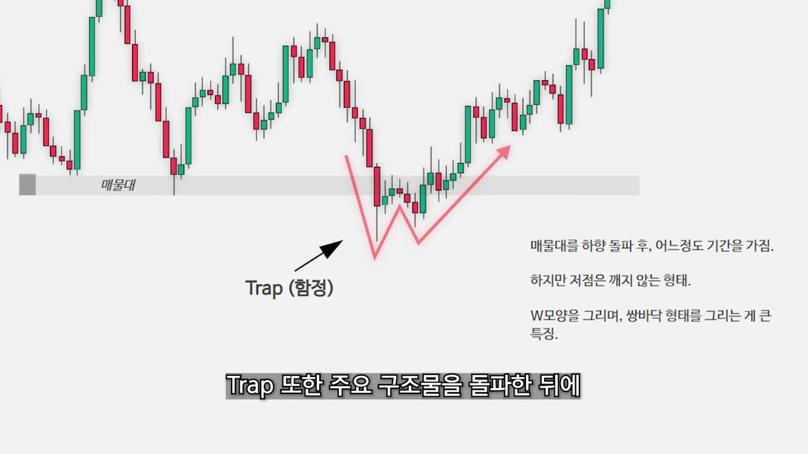

**트랩 (Trap, 함정)**
- 주요 구조물을 **돌파한 뒤 개인 투자자를 유인한 후** 다시 회귀
- 페이크아웃과 달리 돌파 후 **바로 반전이 나오기보단 약간의 텀**을 준다
- **쌍바닥·쌍고점(W/M) 형태**로 형성

| | 페이크아웃 | 트랩 |
|---|---|---|
| 반전 속도 | 즉시 | 텀을 둔다 |
| 모양 | 긴 꼬리, 단일 바닥/고점 | 쌍바닥/쌍고점 (W·M) |

### 6-2. 왜 발생하는가

스마트머니가 수천억 원의 물량을 잡으려 한다고 가정하자. 현재 호가창의 매도 물량만으로는 턱없이 부족하다. **누군가가 대량으로 팔아줘야만** 그 물량을 받아먹으며 진입할 수 있다.

**누가 대량으로 팔아주는가? → 손절하는 개인 투자자가 주 타겟이다.**

개인들은 대부분 **구조물이 깨지는 자리나 직전 저점에 손절 주문**을 걸어둔다. 그래서 스마트머니는 **얇은 호가창을 이용해 가격을 의도적으로 밀어버린다.** 직전 저점이 깨지면 수많은 개인 손절 물량이 나오고, 스마트머니는 싼 가격에 매집할 수 있다.

### 6-3. 어떻게 설계되는가 (4단계)

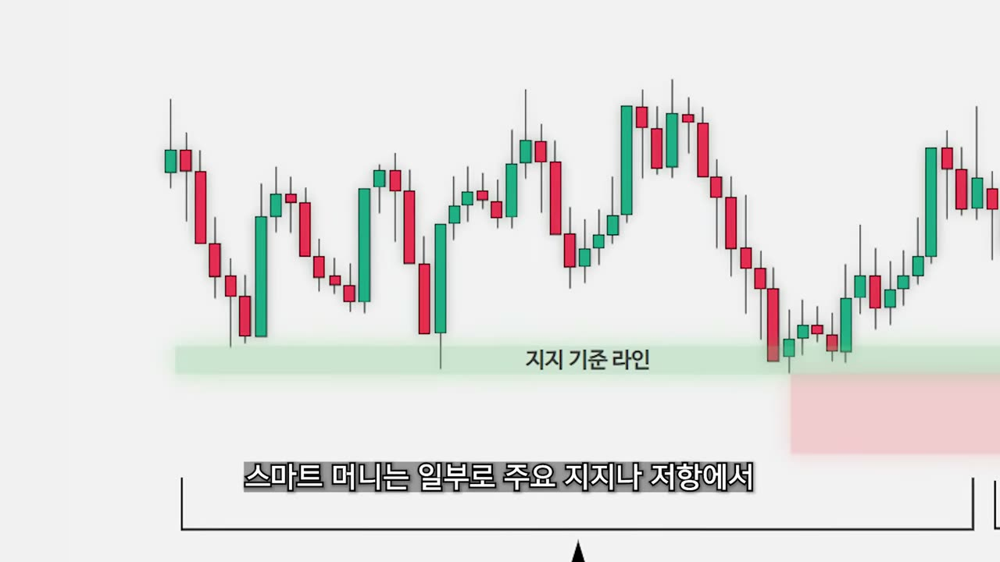

1. 스마트머니는 **일부러 주요 지지나 저항에서 뚜렷한 기준선을 만든다.** 개미를 꼬시기 위함
2. **중요 뉴스 혹은 지표 발표를 좋은 명분으로 삼아** 가격을 밀어버린다 → 개인들은 터져 나가고 스마트머니는 유동성을 흡수
3. 볼일을 마친 스마트머니는 **가벼워진 호가창을 이용해 가격을 다시 기준선 안쪽으로 복귀**시킨다
4. 올라가는 가격을 보고 **개미들은 뒤늦게 따라 붙는다** → 상승에 가속도가 붙는다

### 6-4. 대표적인 출현 위치

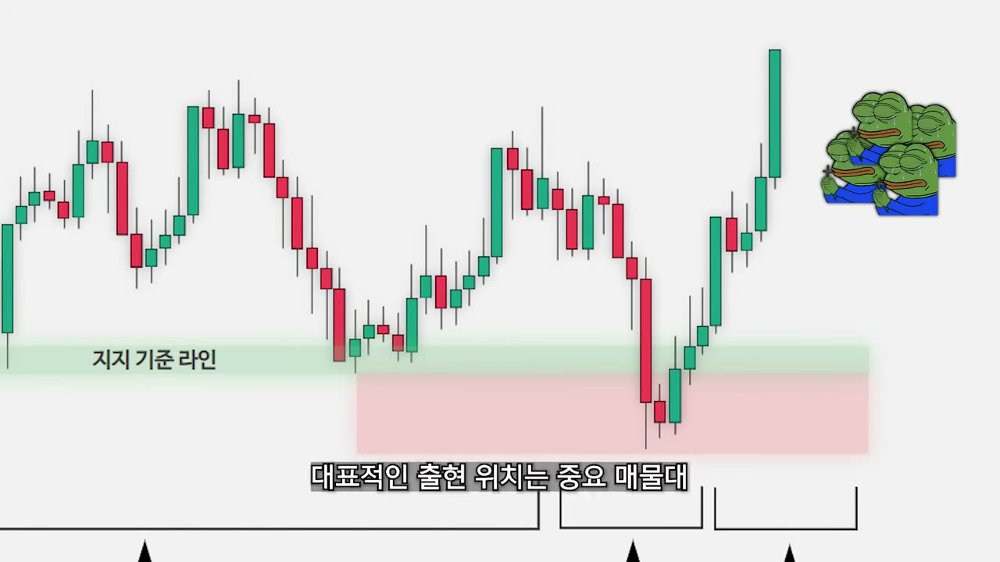

| 위치 | 설명 |
|---|---|
| **중요 매물대** | 고점과 저점이 모여 있는 구간 |
| **패턴 구조물** | 삼각수렴, 쐐기 패턴 |
| **트렌드라인 / 채널** | 3·4강에서 배운 것들. 빈번히 출현 |
| **보조지표** | 대표적으로 **20일 이동평균선**, **200일 이동평균선** |

### 6-5. 매매법 — 2가지

#### 전략 A. 확인 매매 (초보자 권장)

페이크아웃이나 트랩이 **완전히 컨펌되고 나서** 진입하는 매매.

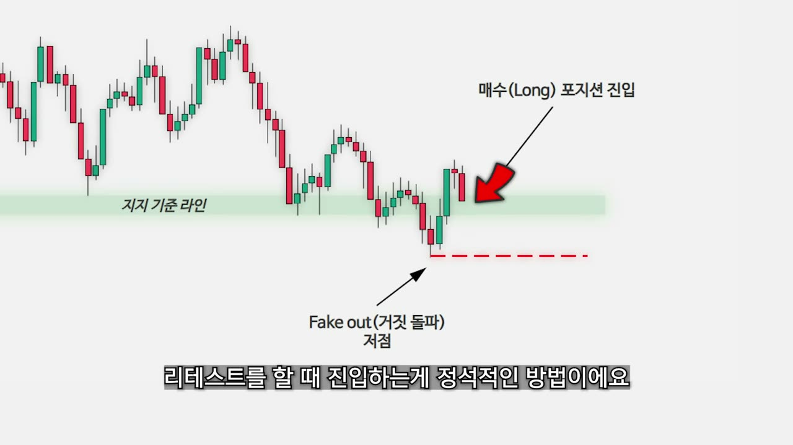

| 항목 | 기준 |
|---|---|
| **진입** | 가격이 기준선을 이탈했다가 **다시 복귀하는 것을 확인**하고 진입. 정석은 ① 복귀할 때 **봉마감 체크** 후 진입, 또는 ② **리테스트**할 때 진입 |
| **손절** | 페이크아웃/트랩이 만들어지면서 **찍었던 최저점(롱) 혹은 최고점(숏)** |
| **익절** | **반대 구조물**이 나올 때. 영상 화자는 대부분 **분할 익절**로 운용 → 1차 분할 익절 후 **평단에 스탑로스**를 걸어 손실 없는 매매로 이어감 |

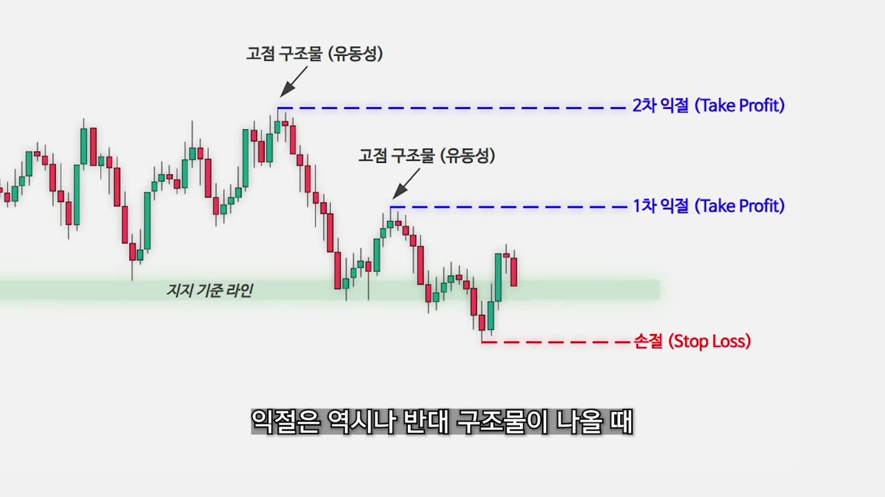

#### 전략 B. 예측 분할 매매 (숙련자용)

> ⚠️ **주의사항 (영상이 명시적으로 붙임)**
> "**떨어지는 칼날을 잡는 하이리스크 하이리턴 전략**이기 때문에 **소액으로 운영**하는 게 좋고, 손절을 주저하면 큰 손실로 이어질 수 있습니다. 그래서 이제 막 시작한 초보자보단 **어느 정도 훈련이 된 숙련자에게 어울리는 매매**인 점은 꼭 인지하셔야 됩니다."

확인 매매와 달리, 페이크아웃·트랩이 **발생할 만한 구간을 미리 찾아둔다.**

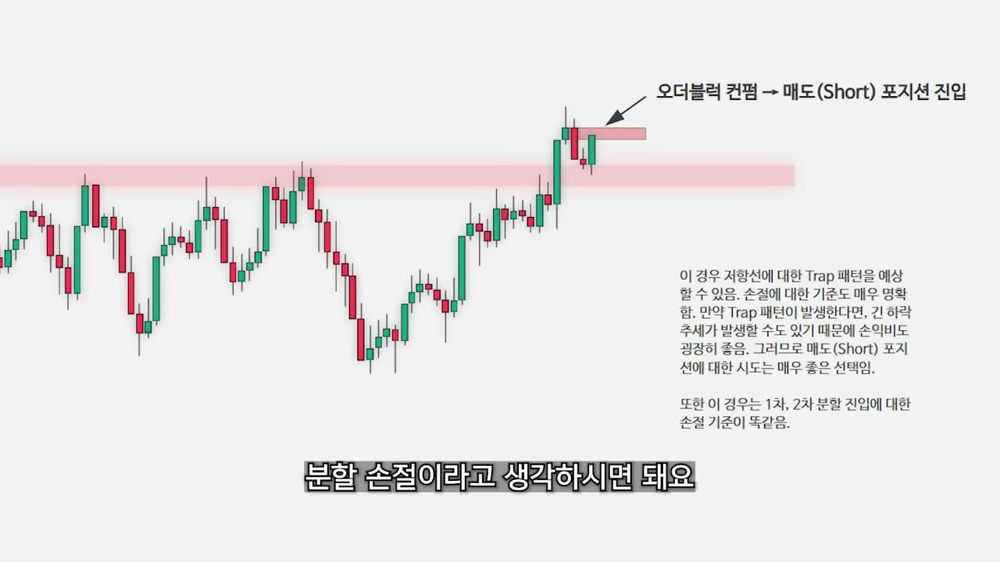

| 항목 | 기준 |
|---|---|
| **진입** | 미리 찾아둔 구간에서 **발생하는 걸 보고 천천히 분할로 진입.** 발생할 때 오더블록이나 FVG 같은 구조물이 나오는 걸 보고 분할 진입해도 무방 |
| **손절** | 꽤나 **엄격**하게. 진입 기준이 됐던 **구조물이 깨지면 손절**이 원칙 |
| **분할 손절** | 분할 진입한 경우 **각 기준마다 진입했던 물량만** 손절. (1번 구조물 깨짐 → 1번 진입 물량만 손절 / 2번 구조물 깨짐 → 2번 진입 물량 손절) |
| **익절** | 반등했다면 **기준선이 됐던 구간을 리테스트할 때 1/2 익절**해서 리스크를 없앤다. 나머지는 **다음 구조물까지 홀딩** |

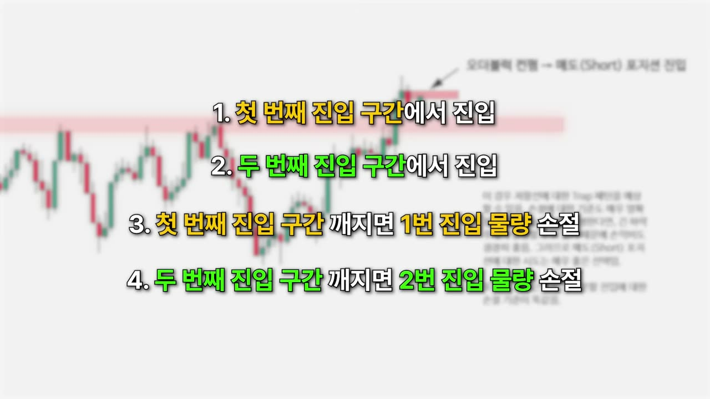

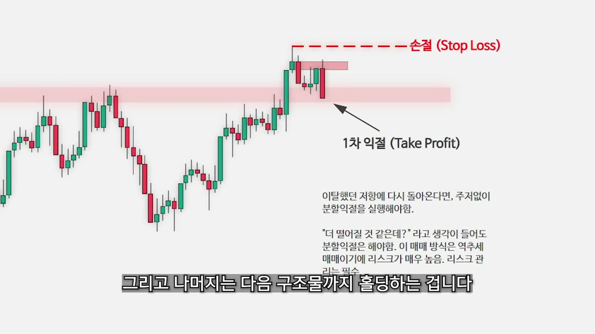

> "이 전략은 **저점을 잡는 전략**이기 때문에 빠르게 분할 익절 처리하면서 **리스크를 없애는 게 첫 번째 목표**입니다. 그래서 숙련자에게 어울리는 매매라는 거예요."

---

## 7. 전체 한눈에 보기

### 7-1. 5가지 기법 요약

| # | 기법 | 역할 | 한 줄 정의 |
|---|---|---|---|
| 1 | **오더블록 (OB)** | 타점 | 큰손의 대량 주문 흔적. 반대 방향 캔들의 몸통을 잡아먹는 캔들 |
| 2 | **FVG** | 타점 | 급격한 가격 이동으로 생긴 연속 3캔들 사이의 빈 공간(불균형) |
| 3 | **추세선** | 방향 | 시장 방향을 읽는 가장 직관적인 선. **결국 깨지게 설계돼 있다** |
| 4 | **채널** | 방향 + 시나리오 | 평행한 두 추세선. **과매수/과매도를 미리 예측**할 수 있다 |
| 5 | **페이크아웃 & 트랩** | 위 4개를 깨는 원리 | 스마트머니가 정석 구조물을 부수고 유동성을 흡수하는 방식 |

### 7-2. 진입 / 손절 / 익절 매트릭스

| 기법 | 진입 | 손절 | 익절 |
|---|---|---|---|
| **오더블록** | OB 구간 도달 시 (닿지 않으면 진입 X) | ① 형성 캔들들(2~3개) 꼬리 끝 이탈 즉시<br>② 꼬리 끝 이탈 **봉마감** | ① 직전 파동 고점(유동성)<br>② 구조물 돌파<br>③ 반대 OB 출현<br>④ 반대 구조물 출현 |
| **FVG** | FVG 구간 도달 시 (닿지 않으면 진입 X) | ① 3캔들 꼬리 끝 이탈<br>② 파동 꼬리 끝 이탈<br>③ ①·② 이탈 **봉마감** | 공통 원칙 (유동성 / 반대 구조물) |
| **추세선 — 추종** | 라인 터치 + **하위 TF 반전 캔들/패턴** 확인 | 진입 근거 반전 패턴 붕괴 | 직전 고점 / 구조물 돌파 |
| **추세선 — 반전** | 붕괴 후 **리테스트** | ① 돌파 파동 시작점·직전 고저점<br>② 라인 역돌파 | 유동성 흡수 자리 / 역추세 패턴 |
| **채널 — 역추세** | 4포인트(과매수·과매도) + 하위 TF 반전 구조물 | 채널 이탈 **봉마감** | ① 채널 반대편 도달<br>② 부분 익절 후 평단 SL + 유동성/구조물 |
| **채널 — 추세(S/R Flip)** | 돌파 후 리테스트 | 채널 내부 복귀 **봉마감** | 유동성 / 반대 구조물 |
| **채널 — 돌파** | 돌파 시 추격 | 내부 복귀 | 반대 구조물 / 유동성 / 확장 채널 중단·반대편 |
| **F&T — 확인 매매** | 기준선 복귀 **봉마감** 또는 리테스트 | F&T가 찍은 최저·최고점 | 반대 구조물 (분할 익절 후 평단 SL) |
| **F&T — 예측 분할** | 예상 구간에서 OB·FVG 보며 **분할** 진입 | 각 진입 근거 구조물 붕괴 시 **분할 손절** | 기준선 리테스트에서 1/2 익절 → 나머지 다음 구조물까지 |

### 7-3. 조합 순서 (영상이 권장하는 사용법)

```
[방향 판단]  추세선 / 채널  ──▶  지금 시장이 어디로 가는가
                  │
                  ▼
[구간 선정]  유동성 자리 · 매물대 · 구조물  ──▶  스마트머니가 사냥할 자리
                  │
                  ▼
[발생 확인]  페이크아웃 / 트랩  ──▶  실제로 유동성이 흡수됐는가
                  │
                  ▼
[정밀 타점]  오더블록 / FVG  ──▶  하위 TF에서 정확한 진입가
                  │
                  ▼
[리스크 관리]  봉마감 손절 · 분할 익절 · 평단 본절
```

- 추세선은 "**메인보다 서브로 쓰는 게 보편적**"이며, **페이크아웃·트랩과 섞어 쓰는 게 훨씬 좋다**
- OB·FVG는 **겹칠 때** 신뢰도가 올라가고 **분할 매수** 구간이 된다
- 유동성 흡수 자리 + 구조물 + OB/FVG가 **동시에 겹치는 자리**가 가장 강한 근거다

---

## 8. 검증 전에 반드시 정의해야 할 것들 (미해결 항목)

영상은 사람이 눈으로 판단하는 것을 전제로 설명한다. 나중에 백테스트하거나 코드로 옮기려면 아래는 전부 **숫자로 정의**해야 한다. 지금 시점에서는 정의되지 않은 상태다.

| # | 모호한 표현 | 정의해야 할 것 |
|---|---|---|
| 1 | "음봉의 몸통을 **잡아먹는**" | 몸통 완전 포함? 50% 이상? 종가 기준? |
| 2 | "몸통 크기 **2배 이상** 차이" | 몸통 = \|종가−시가\|? 꼬리 포함 전체 길이? |
| 3 | "**유동성을 흡수한** 자리" | 직전 고/저점을 몇 틱/몇 % 넘어야 흡수로 볼 것인가 |
| 4 | "**구조물**" | 삼각수렴·컵앤핸들·쐐기의 자동 판정 규칙 |
| 5 | "**하위** 타임프레임" | 몇 분봉 대비 몇 분봉인가 (예: 15m → 3m?) |
| 6 | "OB가 **닿으면** 진입" | OB 상단/하단/중간(50%) 중 어디? |
| 7 | "OB 구간이 **유효한 기간**" | 며칠·몇 봉 지나면 만료되는가 |
| 8 | "3캔들 크기가 **비슷하면**" | 비슷함의 임계값 (표준편차? 비율?) |
| 9 | "**분할** 진입/익절" | 몇 등분? 각 비중은? |
| 10 | 추세선·채널 **작도** | 어떤 고/저점을 자동으로 고를 것인가 — 가장 재현하기 어려운 부분 |
| 11 | 페이크아웃 vs 트랩 **구분** | "약간의 텀"이 몇 봉인가 |
| 12 | 익절 "**반대 구조물**" | 반대 OB만? 패턴까지? 판정 시점은? |

### 8-1. 검증 결과 (2026-08-05 실행)

위 표를 근거로 **5차 검증**을 돌렸다. 상세는 `upbit-rbi-bot/backtesting/research/README.md`
의 "5차 — 정의를 다르게 하면 뒤집히는가", 실행 코드는 `lab_easy_teaching_defs.py` ·
`lab_easy_teaching_v4.py`.

**설계:** 사전 등록 11개 정의 × 2개 타임프레임 = 22셀, 전부 보고. 각 셀은 현행 정의에서
한 축만 바꾼 것. 홀드아웃(2025-12-29~)은 탐색에서 통과 셀이 나올 때만 열기로 미리 정했다.

**발견 1 — 이전 검증에는 범위 제한이 있었다.** 4차가 "필터를 전부 끄고 쟀다"고 했지만
실제로는 **진입 존의 정의가 고정**돼 있었다(진입 존 = 항상 오더블록, FVG 는 인접 근거일 뿐,
확인봉 양봉 요구는 코드에 하드코딩). 영상이 명시하는 **"FVG가 생긴 구간에 진입"**은
한 번도 측정된 적이 없었다.

**발견 2 — 정의를 바꾸니 신호의 정보량이 실제로 달라졌다.** 상승장 드리프트를 대조군으로
빼고 잰 초과 수익률(8시간 보유):

| 정의 | 탐색 구간 | 홀드아웃 |
|---|---:|---:|
| 현행(오더블록 존 + 확인봉) | +0.030%p (t +0.55) | +0.011%p (t +0.15) |
| **영상 원문(FVG 존 + 확인 없음)** | **+0.161%p (t +3.50)** | **+0.159%p (t +3.01)** |

홀드아웃에서 크기가 거의 그대로 재현됐다. **"진입 신호에 방향성 정보가 없다"는 기존 결론은
그 정의에 한정된 것이었다.**

**발견 3 — 그럼에도 비용을 넘지 못한다.** 초과분은 정보량일 뿐, 실제로 버는 건 원시
수익률 − 비용이다. 손절·익절을 빼고 고정 보유로만 재면 홀드아웃 net 은 8봉 −0.194% /
24봉 −0.288% / 48봉 −0.483%. 반익반본 청산으로도 홀드아웃 gross 는 부호가 뒤집혔다
(탐색 +0.114% → 홀드아웃 −0.038%). 탐색 구간의 t +3.30 도 종목 간 동시성을 보정하면
(월 클러스터) **+1.92** 로 떨어져 유의하지 않다.

**결론: 폐기 유지 — 그러나 이유가 바뀌었다.**

| | 기존 기록 | 수정된 사실 |
|---|---|---|
| 엣지 | 거래당 gross **0** | 정의에 따라 **0이 아니다** (원문 정의 시 +0.16%p, 홀드아웃 재현) |
| 벽 | 엣지가 없어서 | **비용**(왕복 0.20~0.25%)이 엣지(0.16%p)보다 커서 |

이 구분이 실질적으로 중요하다. 엣지가 0이면 비용을 낮춰도 소용없지만, **엣지 0.16%p <
비용 0.22%** 라면 비용이 그 아래인 환경에서는 살아난다 — 원저자의 환경이 정확히 그렇다
(레버리지 선물 · 수수료 0 VIP · 양방향). "업비트 현물이라서 안 된다"는 가설이 이번에
처음으로 숫자로 지지됐다.

### 8-2. 5가지 전체 검증 (2026-08-05, 6차)

5차 시점까지 측정된 것은 오더블록·FVG·페이크아웃/트랩 셋뿐이었다. **추세선(3강)과
채널(4강)은 한 번도 구현된 적이 없었다.** 6차에서 둘을 실제로 작도해 재고, 앞의 셋도
같은 통제(드리프트 대조군 · 월 클러스터 t)로 다시 재서 5가지를 한 표에 놓았다.
실행 코드 `lab_easy_teaching_structure.py`, 사전 등록 32셀 전부 보고.

**작도 방식:** 확정된 피벗 2개를 잇는 선(봉 i 에서는 i−k 이전 피벗만 사용 — 미래참조 방지),
채널은 거기에 반대편 최대 이탈점을 3번째 점으로 삼아 평행선을 놓는다. 롱 전용(업비트 현물)
이라 원문 규칙 중 매수가 되는 쪽만 구현했다.

| 강 | 매매법 | 최선 셀 | gross | 월클러스터 t | **드리프트 초과** | 판정 |
|---|---|---|---:|---:|---:|---|
| 1 | 오더블록 | 1시간 | −0.001% | −0.11 | +0.015%p | 정보 없음 |
| 2 | **FVG** | 1시간 | **+0.114%** | +1.92 | **+0.161%p** (홀드아웃 재현) | **정보 있음 · 비용 미달** |
| 3 | 추세선 | 1시간 k=10 | +0.117% | +0.87 | **−0.152%p** | 정보 없음(드리프트 착시) |
| 4 | 채널 | 1시간 | +0.036% | +0.66 | −0.041%p | 정보 없음 |
| 5 | 페이크아웃/트랩 | 1시간 | −0.114% | −1.40 | **−0.196%p** | **유의하게 반대 방향** |

**통과 셀 0/32.** 몇 가지 짚을 점:

- **추세선의 gross +0.117%는 착시였다.** 표면상 가장 좋아 보였지만 드리프트 초과분이
  **−0.152%p로 음수**다 — 신호의 정보가 아니라 상승장 드리프트와 청산 설계가 만든 값이다.
  이래서 초과분 열을 같이 봐야 한다.
- **작도 방식(피벗 k=3/5/10)을 바꿔도 뒤집히지 않았다.** 구조물 매매에서 작도는 곧
  정의이므로 5차의 교훈을 여기에도 적용해 갈랐지만, 어느 k 에서도 통과 셀이 없다.
- **페이크아웃/트랩은 세 번째로 유의하게 반대 방향임이 확인됐다.** 영상이 "가장 중요"
  라고 한 5강이 가장 나쁘다. 게다가 지지의 유의성을 올릴수록 나빠진다
  (k 3→5→10 에서 −0.114 → −0.110 → −0.204%). "더 의미 있는 구조물일수록 좋다"는
  직관이 데이터에서 반복 부정됐다 — 이 패턴이 잡는 건 세력의 손절 사냥이 아니라
  **그냥 하락 추세 중의 반등**일 가능성이 높다.
- **채널 역추세만 미약한 양의 초과분**(+0.07~0.10%p)이 있었으나 유의하지 않다.
- 홀드아웃은 열지 않았다 — 통과 셀이 0이라, 실패한 셀을 다시 던지는 건 홀드아웃의
  순도만 태우고 결론을 바꾸지 못한다(사전 등록 규칙).

**종합:** 5가지 중 진입 신호에 **재현되는 정보가 있는 것은 FVG 하나뿐**이고, 그마저
+0.16%p로 왕복비용에 못 미친다. "일부만 구현해서 결론이 성급했다"는 반론은 이제 닫혔다.

### 8-3. 조합하면 되는가 (2026-08-05, 7차)

원문은 "근거가 겹치는 자리일수록 신뢰도가 높다"고 반복한다. 마지막 질문으로 조합을 쟀다.
기저 신호를 FVG 진입존으로 고정하고 나머지 근거를 맥락 필터로 얹는 방식, 사전 등록 16셀.
실행 코드 `lab_easy_teaching_combo.py`.

**넘어야 하는 산술:** 단일 최대 엣지 +0.16%p, 비용 0.20~0.25% → 조합은 엣지를 40% 이상
올리면서 표본 100거래를 남겨야 한다. **조합은 거래를 급감시키므로 이 둘은 정면으로 상충한다.**

| 조합 (1시간) | 거래 | 드리프트 초과 | 기저 대비 | 표본 잔존 |
|---|---:|---:|---:|---:|
| FVG 단독(기준선) | 5,213 | +0.120%p | — | 100% |
| + 오더블록 | 1,565 | −0.153%p | **−0.273** | 30% |
| + 추세선 | 806 | −0.097%p | **−0.217** | 16% |
| + 채널 하단 | 1,300 | +0.159%p | +0.039 | 25% |
| + 페이크아웃 | 789 | +0.319%p | +0.199 | 15% |
| + OB + 추세선 | 300 | −0.631%p | **−0.751** | 6% |
| + 채널 + 페이크아웃 | **66** | +0.379%p | +0.259 | 1.3% |
| + 근거 2개 이상 | 1,086 | −0.070%p | −0.190 | 21% |

**통과 0/16.** 핵심은 두 가지다.

**조합은 덧셈이 아니라 뺄셈이다.** 정보가 0이거나 음수인 근거를 얹으면 깎인다. 오더블록을
얹으면 −0.273%p, 추세선을 얹으면 −0.217%p, 둘 다 얹으면 −0.751%p에 표본은 6%만 남는다.
"근거를 더 얹을수록 좋다"는 직관이 여기서도 부정됐다.

**좋아 보이는 조합은 전부 표본이 무너져 있다.** FVG+페이크아웃은 초과 +0.319%p로 비용선을
넘어 보이지만 — 월클러스터 t +0.94, **양수월 19개월 중 9개월**(절반 미만), 15분봉에서는
전혀 재현 안 됨(+0.006%p). 채널+페이크아웃은 66거래로 §11 최소 표본에도 못 미친다.

> **자기 정정:** 7차 작업 중, §8-1에서 "FVG는 정보가 있다"고 쓴 근거(초과 +0.16%p)에
> **월클러스터 기준을 적용하지 않았다**는 것을 발견했다. 적용하면 탐색 t +1.31 /
> 홀드아웃 +0.77 로 통상적 유의수준에 못 미친다. 다만 점추정치가 홀드아웃에서 거의 그대로
> 재현됐고(+0.161 → +0.159%p) 월 클러스터가 19개뿐이라 검정력도 낮다 — 정확한 서술은
> **"정보가 있다"가 아니라 "시사적이나 확립되지 않았다"**이다. 비용 미달이라 실무 결론은 같다.

### 8-4. 선물·양방향 검정 (2026-08-05, 8차)

영상의 매매법은 **레버리지 선물**을 전제한다(양방향 · 낮은 수수료). 그래서 마지막으로
**Binance USDT-M 무기한 선물** 13종목 2년치를 받아 **숏까지 포함해** 다시 쟀다.
실행 코드 `data_cache_futures.py` → `lab_futures.py`. 사전 등록 20셀(5매매법 × 2방향 × 2TF).

숏은 별도 구현하지 않고 가격을 **p → 1/p**로 바꿔 같은 롱 코드를 돌렸다 — 역수 공간의
롱 수익률이 원공간 숏 수익률과 수학적으로 일치하므로 구현 비대칭이 원천 차단된다.
펀딩비는 실측값을 방향에 맞춰 반영했다(롱 지불 · 숏 수취).

**1시간봉, 비용 0.12%(선물 taker 0.10% + 슬리피지) + 펀딩:**

| 매매법 | 방향 | gross% | net% | +24봉 초과 | 종목양수 |
|---|---|---:|---:|---:|---:|
| 1강 오더블록 | 롱 / 숏 | +0.053 / +0.030 | −0.071 / −0.088 | −0.065 / −0.002 | 3·1/13 |
| **2강 FVG** | 롱 / **숏** | +0.025 / **+0.112** | −0.100 / **−0.008** | +0.049 / **+0.171** | 1·8/13 |
| 3강 추세선 | 롱 / 숏 | +0.010 / +0.021 | −0.114 / −0.097 | −0.079 / +0.080 | 1·3/13 |
| 4강 채널 | 롱 / 숏 | −0.017 / +0.028 | −0.143 / −0.087 | −0.011 / +0.008 | 1·3/13 |
| 5강 페이크아웃/트랩 | 롱 / 숏 | −0.032 / +0.077 | −0.158 / −0.040 | −0.148 / +0.008 | 0·3/13 |

**통과 0/20.** 발견은 네 가지다.

**① 숏이 롱보다 체계적으로 낫다 — 지적은 사실이었다.** 1시간봉 5개 중 4개, 15분봉은
5개 전부에서 숏이 롱을 이긴다. FVG는 −0.100% → **−0.008%**로 거의 손익분기까지 온다.
"롱 전용이라 하락 국면 기회를 통째로 버린다"는 게 실제로 확인됐다.

**② 그러나 개선분은 전부 비용이고 신호가 아니다.**

| | gross | net | 왕복비용 |
|---|---:|---:|---:|
| 업비트 현물 롱 | +0.098% | **−0.160%** | 0.22~0.25% |
| 선물 숏 | +0.112% | **−0.008%** | 0.12% |

net 개선폭이 비용 차이와 거의 정확히 일치한다. **gross는 여전히 0 근처다** — 거래소를
바꿔서 좋아진 것이지 신호가 좋아진 게 아니다.

**③ net > 0이 되려면 수수료가 0이어야 한다.** 같은 거래에 비용만 바꾸면 — 0.12%: 0/10셀
양수, 0.10%: 1/10, **0%: 8/10**. 원저자가 말한 "수수료 0 VIP"에서는 실제로 대부분
양수가 된다. 그런데 바이낸스 최고 등급(VIP 9)도 taker 0.017%이고 0%는 도달 불가능하다.
**이 매매법들은 비용 경계선 위에 정확히 걸터앉아 있다** — 왕복 0.10% 아래면 간신히 양수,
그 위면 음수. 실전 비용에서 안전 마진이 전혀 없다.

**④ 유의성은 어디에도 없다.** 최우수 셀 FVG 숏조차 월클러스터 t −0.06, **양수월 17개월
중 7개월**. net ≈ 0은 달마다 동전 던지기다.

**결론:** "업비트 현물이라서 안 된다"는 가설은 **부분적으로만 옳았다.** 정확히는
**어느 거래소에서도 신호 자체에는 비용을 이길 엣지가 없고, 거래소는 손실 크기만 바꾼다.**

**여전히 남은 한계 (정직하게):**
- 역수 미러링은 ATR 같은 절대 스케일 지표 값을 바꾼다 — 롱/숏이 완전히 동일 조건은 아니다.
- 레버리지·청산가·증거금은 모델에 없다. 다만 레버리지는 손익을 같은 배수로 늘릴 뿐
  **거래당 기댓값의 부호를 바꾸지 못한다**(음수면 파산을 앞당길 뿐이다).
- 구조물 작도는 피벗 기반 자동 작도이고, 사람이 눈으로 고르는 것과 같지 않다.
- 익절 기준 중 "삼각수렴·컵앤핸들·쐐기 돌파"는 패턴 자동판정이 없어 미구현이다.
- 조합(§8-3)은 선물에서 다시 재지 않았다. 7차·8차 결과로 보아 새 결과가 나올 여지는
  크지 않으나, **이건 논증이지 측정이 아니다.**

---

## 9. 용어 사전

| 용어 | 쉬운 말 |
|---|---|
| **스마트머니** | 기관·세력, 돈 많은 큰손 |
| **유동성 (liquidity)** | 이 영상에선 사실상 "**손절 주문이 몰려 있는 자리**". 직전 고점 위·저점 아래 |
| **유동성 흡수 / 스윕** | 그 손절 물량을 털어서 삼키는 것 |
| **슬리피지** | 주문이 원하는 가격에 안 붙고 밀려서 체결되는 것 |
| **호가창이 얇다** | 사려는·팔려는 주문이 적어서 조금만 사도 가격이 확 튀는 상태 |
| **커버링** | 수익 실현. 특히 공매도(숏)를 되사서 정리하는 것 |
| **눌림목** | 오르던 가격이 잠깐 되돌아 내려온 자리 |
| **리테스트** | 뚫고 나간 선에 가격이 **다시 한 번 돌아와서 닿는** 것 |
| **S/R Flip** | 지지(Support)가 뚫리면 저항(Resistance)이 되고, 그 반대도 성립 |
| **봉마감** | 그 캔들이 완전히 끝나서 종가가 확정되는 것 |
| **본절** | 손실도 이익도 없는 상태. 스탑로스를 진입가로 올려두면 최악이 본절 |
| **분익 (분할 익절)** | 물량을 나눠서 여러 번에 걸쳐 익절 |
| **휩쏘 (whipsaw)** | 위아래로 속임수 움직임. 페이크아웃/트랩과 같은 맥락 |
| **FOMO** | 나만 못 탔다는 조바심에 뒤늦게 뛰어드는 것 |
| **컨펌** | 확정. "확인되고 나서" |
| **매물대** | 거래가 많이 일어나 고점·저점이 몰려 있는 가격 구간 |

---

## 10. 영상 밖 참고

- 영상 화자는 **구독 시 무료로 공개하는 별도 자료(Notion 형태)**를 안내한다. 채널 홈탭 → 고정 영상 → 고정 댓글의 링크. 구성은 `0강 시작하며 / 1강 오더블록 / 2강 FVG / 3강 추세선 / 4강 채널 / 5강 거짓돌파(Fake out)와 함정(Trap)`이며, 각 강 하단에 **Q&A**가 붙어 있다고 한다. 이 문서는 **영상만으로** 정리한 것이라 그 Q&A 내용은 포함돼 있지 않다.
- 같은 폴더의 이전 정리본(2025.09 / 2025.10 / 2025.11)은 자막 원문이다. 그중 2025.09 영상이 같은 5가지 주제를 다루지만, 이번 영상이 **각 기법의 형성 원리와 진입·손절·익절 기준을 훨씬 구체적으로** 다룬다.

---

*자막 원문은 같은 폴더의 `2025. 12. 16. 투자 초보 인생을 바꿀 5가지 단타 매매법 (자막 원문).md` 참조.*
